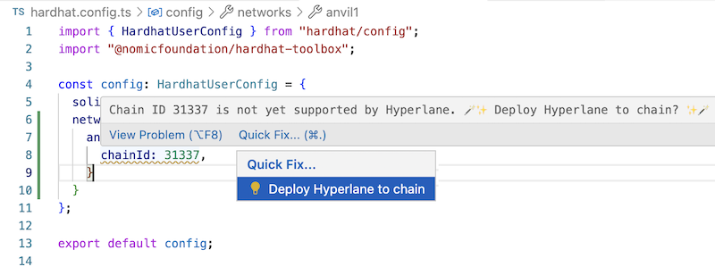

# Hyperlane VS Code

View Hyperlane availability on different chains and deploy Hyperlane to any chain.



## Functionality

Detects .js and .ts files which have a reference to a chain ID, which can be in a format that looks like:
```
  chainId: <number>,
```

For example, this chainId reference may be provided in a [Hardhat config file](https://hardhat.org/hardhat-runner/docs/config#json-rpc-based-networks).

This extension provides highlighting and hover information to view Hyperlane deployment status of the referenced chain, and lets you deploy Hyperlane to it with one click if it's not yet available there.

## Settings

In VS Code's settings, under Extensions > Hyperlane VS Code, the following settings are required:

- `configDir`: The Hyperlane config directory, for example: `/Users/username/hyperlane`
- `privateKey`: Private key for deployments

## Config Directory

The config dir can be a directory which is an empty folder. The extension allows you to generate sample config files in the config dir, or you can use the web app to configure your deployments and save the resulting JSON files to the config dir specified in the VS Code extension settings.

The supported fields in each config file are as per https://github.com/hyperlane-xyz/hyperlane-deploy/tree/main/config, but in JSON format, and the files must have a .json extension.

## UI

Web app for configuring deployments is available at https://hyperlane-vscode.vercel.app/

See [ui/README.md](ui/README.md)

## Contributing

See [CONTRIBUTING.md](CONTRIBUTING.md)